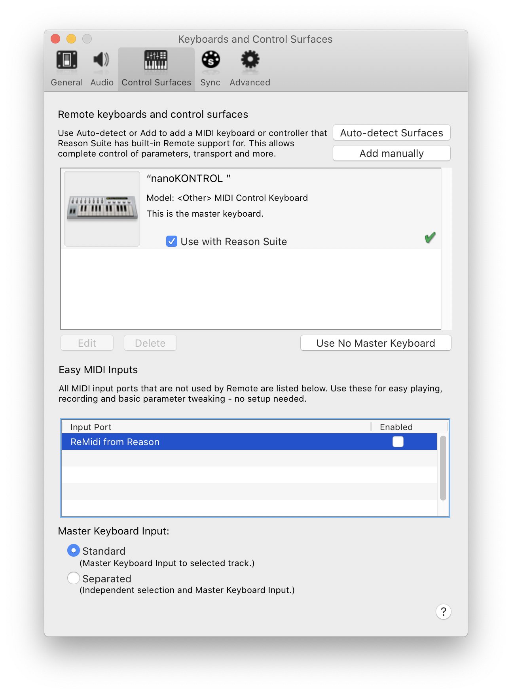
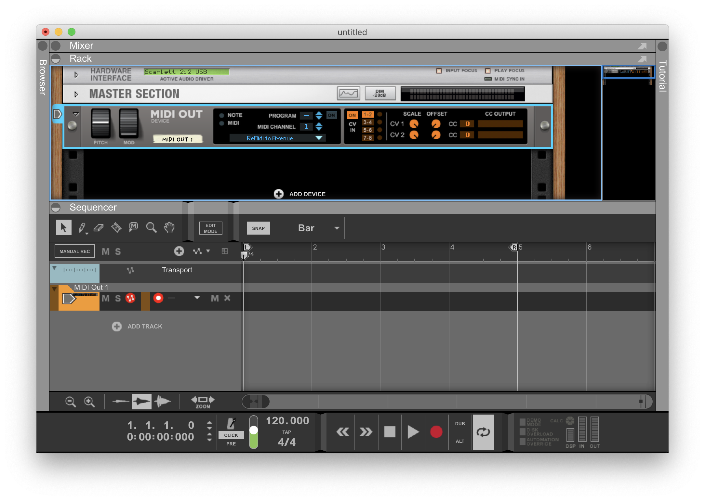
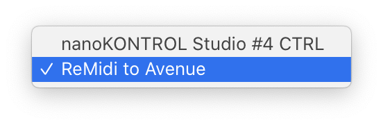
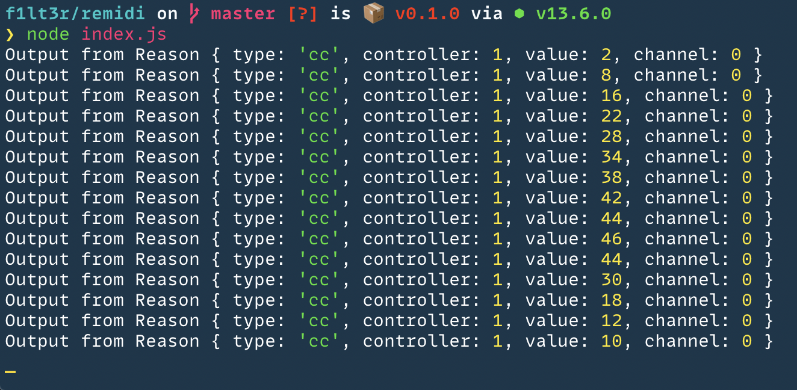
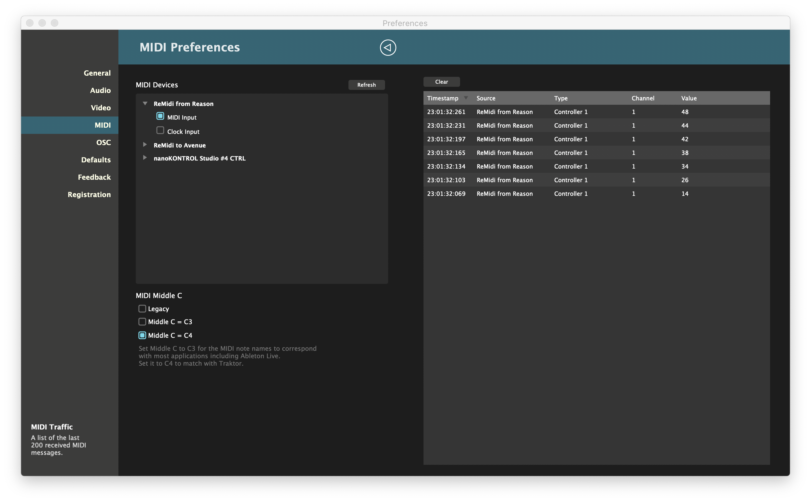

# ReMidi

> Pipe MIDI messages from one app to another.

## Purpose

I wanted to connect [Reason Studio](https://www.reasonstudios.com/) to [Resolume Avenue](https://resolume.com/) so that I could create an automated audio/video composition that was controlled by MIDI. I wanted something that was more performant than the [clunky IAC Bus](https://www.logicprohelp.com/forum/viewtopic.php?t=139225) and more stable than [MidiPipe](http://www.subtlesoft.square7.net/MidiPipe.html).

## Pre-Requisites

- Node.js
- Two Midi Applications you want to link

## Install

1. Clone this repository.
1. Install the Node dependencies.

    ```shell
    npm install
    ```

## Usage

> Press <kbd>Control</kbd> + <kbd>C</kbd> twice, to quite the program.

1. Start the MIDI server with Node.js.

    ```shell
    node index.js
    ```

1. Goto Reason Studio MIDI Preferences and disable "ReMidi from Reason".

    > ⚠️ Important: If you stop and start the program, you will need to go back into Reason MIDI preferences and disable "ReMidi from Reason" again, otherwise your will start an infinite MIDI loop.

    

2. Create a MIDI Output device in Reason studio.
     

3. Choose "ReMidi to Avenue" from the input dropdown.

     

4. Move the Mod Wheel on the MIDI output and you should see MIDI messages in your terminal.

    

5. You can select the "ReMidi from Reason" device from another application, and see the same MIDI messages.

    > In this case I am using [Resolume Avenue](https://resolume.com/).

    

## Example Code

```js
const easymidi = require('easymidi');

const avenue = new easymidi.Output('ReMidi from Reason', true);
const reason = new easymidi.Input('ReMidi to Avenue', true);

reason.on('noteon', ({_type: type, channel, note, velocity}) => {
	console.log('Output from Reason', {type, channel, note, velocity});
	avenue.send(type, {channel, note, velocity});
});

reason.on('noteoff', ({_type: type, channel, note, velocity}) => {
	console.log('Output from Reason', {type, channel, note, velocity});
	avenue.send(type, {channel, note, velocity});
});

reason.on('cc', ({_type: type, controller, value, channel}) => {
	console.log('Output from Reason', {type, controller, value, channel});
	avenue.send(type, {controller, value, channel});
});

console.log('ReMidi is running!');
```

## Conclusion

This simple code allows you to send MIDI messages easily from one application to another.

In my case, I can write an audio/visual composition in Reason. Reason triggers and changes the video clips and parameters in Avenue, making the music and the music video a single process.

You can update the code if you want to provide more channels, and change the names.

Contact me you need help.

~ [F1LT3R](https://f1lt3r.io)
